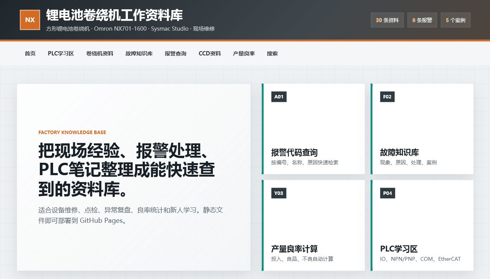

# 锂电池卷绕机工作资料库网站

这是一个可部署到 GitHub Pages 的纯静态资料库网站，用于学习、查找、整理方形锂电池卷绕机现场资料。



## 项目判断

当前项目类型：纯 HTML + CSS + JavaScript 静态网站。

不是 Vite、React、Vue 项目，也不是 Node 后端项目。网站不需要本地数据库，资料数据全部保存在 JSON 文件中。

## 功能

- 首页常用入口
- 资料来源导航：只收集公开资料和官方资料链接
- PLC学习区：输入输出、NPN/PNP、COM端、EtherCAT、伺服控制、Sysmac Studio笔记
- 卷绕机资料区：放卷、张力、纠偏、CCD、卷针、贴胶、下料
- 故障知识库：故障现象、可能原因、处理方法、现场案例
- 报警代码查询：报警编号、报警名称、原因、解决方法
- CCD资料：下料CCD NG、卷绕CCD NG、极耳检测、线扫检测
- 产量良率计算
- 全站关键词搜索
- 手机和电脑自适应

## 项目结构

```text
.
├── index.html
├── style.css
├── script.js
├── data/
│   ├── alarm.json
│   ├── plc_notes.json
│   ├── winding_notes.json
│   ├── ccd_notes.json
│   ├── fault_cases.json
│   └── source_links.json
├── images/
│   ├── .gitkeep
│   └── preview.png
├── docs/
│   ├── deploy-github-pages.md
│   └── update-data.md
├── .nojekyll
└── README.md
```

## 路径规则

本项目已按公网静态网站方式整理：

- CSS 使用相对路径：`style.css`
- JS 使用相对路径：`script.js`
- JSON 使用相对路径：`data/*.json`
- 图片使用相对路径：`images/*`
- 首页文件名固定为：`index.html`

不要在代码或资料中写本机磁盘路径，也不要写本地服务地址。

## GitHub 仓库应该怎么建

建议新建公开仓库：

```text
winder-knowledge-site
```

如果你的 GitHub 用户名是 `myname`，仓库名是 `winder-knowledge-site`，部署完成后的公网网址格式就是：

```text
https://myname.github.io/winder-knowledge-site/
```

## 文件应该上传到哪里

把本项目所有文件上传到 GitHub 仓库根目录。

上传后，仓库根目录应该能直接看到：

```text
index.html
style.css
script.js
data/
images/
docs/
README.md
.nojekyll
```

不要把这些文件再放进额外的外层文件夹。

## GitHub Pages 应该选哪个分支

1. 打开 GitHub 仓库。
2. 进入 `Settings`。
3. 进入 `Pages`。
4. `Build and deployment` 选择 `Deploy from a branch`。
5. `Branch` 选择 `main`。
6. 目录选择 `/root`。
7. 保存。

GitHub Pages 发布完成后，访问地址格式为：

```text
https://你的GitHub用户名.github.io/winder-knowledge-site/
```

## 使用 GitHub CLI 发布

如果电脑已安装 Git 和 GitHub CLI，并且已经登录 GitHub，可以在项目根目录执行：

```powershell
git init -b main
git add .
git commit -m "Publish winder knowledge site"
gh repo create winder-knowledge-site --public --source . --remote origin --push
```

然后到 GitHub 仓库 `Settings` -> `Pages` 中选择：

```text
Source: Deploy from a branch
Branch: main
Folder: /root
```

保存后等待 GitHub Pages 发布。

## 手机访问说明

部署到 GitHub Pages 后，手机浏览器直接打开公网网址即可。

示例格式：

```text
https://你的GitHub用户名.github.io/winder-knowledge-site/
```

手机访问时应检查：

- 页面宽度适配手机屏幕。
- 搜索框可以输入关键词并显示结果。
- 报警代码查询可以按编号、名称、原因过滤。
- 图片可以正常显示。
- JSON 数据可以正常加载。

## 更新资料的方法

直接编辑 `data/` 目录中的 JSON 文件。

资料来源导航：`data/source_links.json`

公开网站只放公开资料和官方资料链接。公司内部文件、现场原始资料、图纸、SOP、FAT问题清单、行政文件不要上传到公开网站。

报警代码：`data/alarm.json`

```json
{
  "code": "ALM-WD-001",
  "name": "卷绕张力异常",
  "reason": "张力传感器反馈超出设定范围。",
  "solution": "检查放卷轴、过辊、张力传感器零点和PID参数。"
}
```

故障案例：`data/fault_cases.json`

```json
{
  "module": "张力",
  "priority": "高",
  "title": "卷绕时极片周期性起皱",
  "symptom": "高速后极片边缘出现周期性褶皱。",
  "possible_causes": ["过辊轴承卡滞", "张力参数不合适"],
  "actions": ["清洁过辊", "调整张力参数"],
  "case_note": "清洁张力辊并恢复配方参数后改善。"
}
```

更多说明见 [更新资料方法](docs/update-data.md)。

## Vercel 部署方式

如果使用 Vercel：

1. 将项目上传到 GitHub。
2. 在 Vercel 中导入该仓库。
3. Framework Preset 选择 `Other`。
4. Build Command 留空。
5. Output Directory 留空或填写项目根目录。
6. 部署完成后，Vercel 会生成公网网址。

## 相关文档

- [GitHub Pages 部署步骤](docs/deploy-github-pages.md)
- [更新资料方法](docs/update-data.md)
